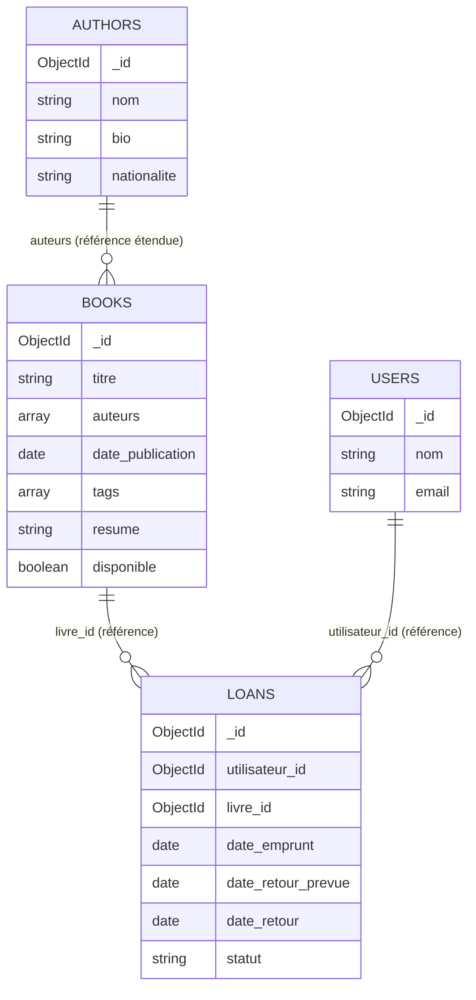

# Diagramme des relations — Bibliothèque Numérique

Ce diagramme peut être visualisé directement dans GitHub (les fichiers
`.md` contenant du code Mermaid sont rendus automatiquement) ou copié
dans tout éditeur compatible Mermaid (ex. [mermaid.live](https://mermaid.live)).

## Lecture du diagramme

- **AUTHORS → BOOKS** : un auteur peut être associé à plusieurs livres
  (relation 1 → N). La relation est matérialisée par une **référence
  étendue** : chaque livre embarque `{ auteur_id, nom }` dans son
  tableau `auteurs`, tandis que la fiche complète de l'auteur reste
  dans la collection `authors`.
- **BOOKS → LOANS** : un livre peut faire l'objet de plusieurs emprunts
  au fil du temps (relation 1 → N), via une **référence pure**
  (`livre_id`) dans chaque document `loans`.
- **USERS → LOANS** : un utilisateur peut avoir plusieurs emprunts
  (relation 1 → N), via une **référence pure** (`utilisateur_id`) dans
  chaque document `loans`.
