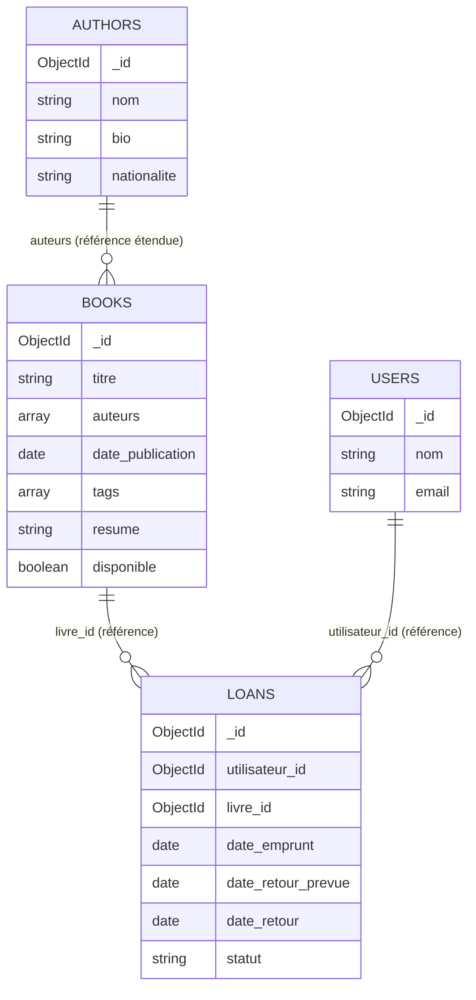

# Exploration et Implémentation NoSQL

### Conception et implémentation d'une base de données documentaire avec MongoDB

---

**Nom :** [À compléter]
**Formation :** [À compléter — ex. Master Data Science / Intelligence Artificielle]
**Établissement :** [À compléter]
**Enseignant :** [À compléter]
**Année universitaire :** 2025 – 2026

---

## Introduction

Les bases de données NoSQL (*Not Only SQL*) désignent une famille de
systèmes de gestion de données apparus pour répondre aux limites des
bases relationnelles face à des volumes massifs, des structures de
données hétérogènes et des besoins de scalabilité horizontale. Contrairement
aux SGBD relationnels, organisés autour de tables et d'un schéma rigide,
les bases NoSQL adoptent des modèles variés — documentaire, clé-valeur,
colonnes larges, graphes — chacun optimisé pour des cas d'usage précis.

Ce devoir a pour objectif d'étudier les compromis fondamentaux entre
bases relationnelles et bases NoSQL (théorème CAP, dénormalisation,
choix technologique selon le type de données), puis de mettre ces
notions en pratique à travers la conception et l'implémentation d'une
base de données documentaire avec **MongoDB**.

MongoDB a été retenu pour la partie pratique car il s'agit du système
NoSQL documentaire le plus répandu en entreprise, doté d'un écosystème
mature (MongoDB Atlas, pilotes officiels dont PyMongo) et particulièrement
adapté à la modélisation d'entités riches et imbriquées comme celles
d'une bibliothèque numérique (livres, auteurs, emprunts).

---

# Partie 1 — Analyse théorique

## 1. Théorème CAP

Le théorème CAP, formulé par Eric Brewer, énonce qu'un système
distribué de stockage de données ne peut garantir **simultanément**
que deux des trois propriétés suivantes :

- **Consistency (Cohérence)** : toute lecture reçoit la donnée la plus
  récemment écrite, ou une erreur. Tous les nœuds du système
  renvoient la même valeur pour une même donnée à un instant donné.
- **Availability (Disponibilité)** : chaque requête reçoit une réponse
  (succès ou échec applicatif), sans garantie que la donnée renvoyée
  soit la plus récente, mais le système répond toujours.
- **Partition Tolerance (Tolérance au partitionnement)** : le système
  continue de fonctionner malgré la perte ou le retard de messages
  réseau entre des nœuds (coupure réseau, latence, nœud injoignable).

Dans un système distribué réel, les partitions réseau sont
inévitables (panne matérielle, congestion réseau, coupure entre
centres de données). La tolérance au partitionnement (P) n'est donc
pas une option mais une contrainte de fait. Le théorème CAP implique
alors qu'**en cas de partition effective**, le système doit choisir
entre :

- rester **cohérent** en refusant de répondre à certaines requêtes
  tant que la cohérence entre nœuds n'est pas garantie (système CP) ;
- rester **disponible** en répondant malgré tout, au risque de
  renvoyer une donnée légèrement obsolète (système AP).

Il ne s'agit donc pas d'un choix entre trois propriétés au repos, mais
d'un arbitrage entre C et A qui ne se manifeste concrètement **que
lors d'une partition réseau** ; en fonctionnement normal (sans
partition), la plupart des systèmes offrent à la fois cohérence et
disponibilité.

**Cohérence forte vs cohérence éventuelle**

- La **cohérence forte** garantit qu'après une écriture, toute lecture
  ultérieure (sur n'importe quel nœud) renvoie systématiquement la
  valeur écrite. Cela implique une coordination entre nœuds avant de
  valider l'écriture, au prix d'une latence plus élevée.
- La **cohérence éventuelle** (*eventual consistency*) accepte qu'un
  nœud puisse renvoyer temporairement une valeur obsolète après une
  écriture, avec la garantie que tous les nœuds convergeront vers la
  même valeur en l'absence de nouvelles écritures. Cela privilégie la
  disponibilité et les performances au prix d'incohérences
  temporaires.

**Positionnement sur le triangle CAP**

```text
                        C (Cohérence)
                       /              \
                      /                \
                     /     MongoDB      \
                    /   (CP par défaut,  \
                   /   AP en lecture      \
                  /    secondaire/w:1)     \
                 /                          \
                A ---------------------------- P
          (Disponibilité)          (Tolérance partition)

        Redis (cluster) : proche de CP           Cassandra : AP
        (réplication master, cohérence          (cohérence éventuelle,
         forte sur le primaire)                  disponibilité max)
```

- **Cassandra** est un système **AP** par conception : son architecture
  *peer-to-peer* sans nœud maître privilégie la disponibilité et la
  tolérance au partitionnement, avec une cohérence éventuelle par
  défaut. Cependant, Cassandra permet d'ajuster le niveau de cohérence
  par requête (*consistency level* : `ONE`, `QUORUM`, `ALL`), ce qui
  permet de se rapprocher d'une cohérence forte au prix de la
  disponibilité et de la latence — la nuance est donc réglable, pas figée.
- **MongoDB** est généralement classé **CP** : en cas de partition, le
  jeu de réplicas (*replica set*) élit un nouveau nœud primaire et
  privilégie la cohérence des écritures (le primaire est la seule
  source de vérité en écriture). Toutefois, MongoDB propose des
  réglages fins via les niveaux de `readConcern`, `writeConcern` et la
  lecture sur nœuds secondaires : une lecture avec `readPreference:
  secondary` peut renvoyer une donnée légèrement obsolète, rapprochant
  alors le comportement d'un système AP pour ce type de requête. Le
  positionnement CP de MongoDB n'est donc valable que pour son
  comportement d'écriture par défaut.
- **Redis**, en mode cluster avec réplication asynchrone, se comporte
  également plutôt en **CP côté écriture sur le nœud maître** (les
  écritures sont cohérentes sur le nœud responsable d'un slot), mais
  la réplication asynchrone vers les répliques peut entraîner une
  perte de données récentes en cas de bascule (*failover*), ce qui
  introduit une forme de cohérence éventuelle côté lecture sur les
  répliques.

**Choix pour le flux d'activité en temps réel**

Pour le flux d'activité (posts, likes, commentaires) de l'application
sportive, **Cassandra** est la solution la plus adaptée :

- **Haute fréquence des écritures** : Cassandra est optimisé pour des
  écritures massives grâce à son moteur de stockage en *log-structured
  merge-tree* (LSM-tree), qui transforme les écritures aléatoires en
  écritures séquentielles très rapides.
- **Scalabilité horizontale** : son architecture *peer-to-peer* sans
  nœud maître permet d'ajouter des nœuds de façon linéaire, sans point
  de contention central, contrairement au primaire unique en écriture
  de MongoDB.
- **Disponibilité** : Cassandra est conçu pour rester disponible même
  en cas de perte de plusieurs nœuds, ce qui convient à un flux
  social où l'indisponibilité, même brève, dégraderait fortement
  l'expérience utilisateur.
- **Tolérance aux pannes** : la réplication multi-nœuds sans maître
  unique élimine le risque de point unique de défaillance (SPOF) que
  représente le primaire de MongoDB en écriture.
- **Temps de réponse** : les écritures locales (sans attente de
  quorum strict) offrent une latence très faible, adaptée à un flux
  d'activité à fort volume.

**Pourquoi les deux autres solutions sont moins adaptées :**

- **MongoDB** reste pertinent pour les profils utilisateurs (données
  riches, imbriquées, moins fréquemment écrites), mais son primaire
  unique en écriture devient un goulot d'étranglement pour un flux
  d'activité à très haute fréquence d'écriture, et le
  *resharding* horizontal est plus complexe à opérer que l'ajout de
  nœuds Cassandra.
- **Redis** offre d'excellentes performances en lecture/écriture car
  il fonctionne principalement en mémoire, mais il est avant tout
  pensé comme un cache ou un stockage clé-valeur à faible latence,
  avec une persistance et une capacité de stockage massif moins
  adaptées à l'archivage durable d'un flux d'activité volumineux que
  Cassandra, pensé nativement pour la distribution et le stockage à
  grande échelle sur disque.

## 2. Dénormalisation

**Normalisation SQL.** Dans un modèle relationnel, la normalisation
consiste à organiser les données pour éliminer les redondances : chaque
information n'est stockée qu'à un seul endroit, et les entités liées
sont reliées par des clés étrangères. Un livre et son auteur, par
exemple, seraient stockés dans deux tables distinctes, jointes lors
des requêtes via une clause `JOIN`.

**Dénormalisation NoSQL.** À l'inverse, les bases NoSQL documentaires
comme MongoDB encouragent souvent la dénormalisation : dupliquer une
partie des données liées directement dans le document principal, afin
d'éviter les jointures coûteuses à l'exécution et de pouvoir répondre
à une requête en un seul accès disque.

**Le principe « model based on queries ».** Contrairement au modèle
relationnel, conçu autour de la structure des entités et de leurs
relations (modèle entité-association), la modélisation NoSQL est
généralement pensée **en fonction des requêtes** que l'application
devra exécuter le plus fréquemment. On se demande d'abord « quelles
données dois-je lire ensemble, et à quelle fréquence ? » avant de
déterminer comment les documents doivent être structurés. C'est cette
logique qui justifie, par exemple, d'embarquer le nom d'un auteur
directement dans le document livre plutôt que de systématiquement
interroger la collection des auteurs.

**Avantages de la dénormalisation :**

- Moins de jointures, donc des lectures plus rapides et un nombre
  réduit d'accès à la base.
- Meilleure adéquation avec la façon dont l'application consomme les
  données (un document = une réponse API complète).
- Facilité de distribution horizontale : un document autonome peut
  être placé sur n'importe quel nœud sans dépendre d'un autre document
  situé ailleurs.

**Principal risque.** Le risque majeur concerne l'**intégrité et la
cohérence des données** : lorsqu'une information dupliquée change
(ex. le nom d'un auteur est corrigé), il faut mettre à jour toutes les
copies existantes, sous peine d'incohérences entre les documents. Ce
risque doit être arbitré au cas par cas selon la fréquence de
modification de la donnée dupliquée.

**Exemple concret dans l'application sportive.** Dans le flux
d'activité, un post pourrait embarquer directement le pseudonyme et la
photo de profil de son auteur, plutôt que de les référencer
systématiquement. Cela permet d'afficher le fil d'actualité en une
seule lecture. En contrepartie, si l'utilisateur change de pseudonyme,
les posts déjà publiés continueront d'afficher l'ancien pseudonyme
tant qu'un mécanisme de mise à jour différée n'aura pas été exécuté —
un compromis généralement acceptable pour ce type de donnée
faiblement volatile.

## 3. Cassandra vs MongoDB pour les séries temporelles

Pour des données de séries temporelles à très haute fréquence (mesures
GPS, fréquence cardiaque, température de capteurs IoT prises chaque
seconde), une base orientée colonnes comme **Cassandra** présente
plusieurs avantages structurels par rapport à MongoDB :

| Critère | Cassandra | MongoDB |
|---|---|---|
| **Structure des données** | Modèle en familles de colonnes, avec des clés de partition et de tri natives pour organiser les données par entité et par temps (ex. partition par utilisateur, tri par timestamp). | Modèle documentaire orienté objet ; les séries temporelles nécessitent une modélisation manuelle (bucketing) pour éviter des documents trop volumineux ou trop nombreux. |
| **Volume d'écriture** | Optimisé pour l'écriture massive et continue grâce au moteur LSM-tree ; les écritures sont séquentielles et très rapides. | Bonnes performances en écriture, mais moins optimisées que Cassandra pour un flux constant et massif de très petites écritures. |
| **Scalabilité** | Scalabilité linéaire par simple ajout de nœuds, sans nœud maître. | Scalabilité horizontale possible via le *sharding*, mais plus complexe à administrer et moins linéaire que Cassandra. |
| **Distribution** | Architecture peer-to-peer, données automatiquement réparties par hachage de la clé de partition. | Architecture avec nœud primaire par shard ; distribution efficace mais nécessite une stratégie de clé de *shard* bien choisie. |
| **Performances en écriture continue** | Constantes même à très grande échelle, avec une latence prévisible. | Peuvent se dégrader si le volume d'écriture dépasse la capacité du primaire d'un shard. |
| **Requêtes temporelles** | Très efficaces lorsque les données sont organisées par plage de temps dans la clé de tri (*clustering key*). | Possibles via des index sur les champs de date, mais moins optimisées nativement pour des scans de plages temporelles massives. |
| **Stockage massif** | Conçu pour des volumes de plusieurs téraoctets à pétaoctets répartis sur de nombreux nœuds. | Capable de gérer de grands volumes, mais généralement utilisé à une échelle inférieure à celle visée par Cassandra pour ce cas d'usage. |
| **Disponibilité** | Très haute disponibilité par réplication multi-nœuds sans maître unique. | Haute disponibilité via replica set, mais dépendante de l'élection d'un nouveau primaire en cas de panne. |

**Conclusion.** Pour des mesures de capteurs prises à haute fréquence
(GPS, fréquence cardiaque), Cassandra est structurellement plus adapté
car son modèle de données (clé de partition + clé de tri temporelle)
correspond exactement au schéma d'accès de ce type de données : écrire
en continu, puis lire une plage temporelle pour une entité donnée
(un utilisateur, un capteur). MongoDB reste néanmoins un choix
raisonnable si le volume de mesures est modéré et si ces données
doivent être combinées avec d'autres documents riches (ex. le détail
d'un parcours de course avec ses métadonnées), grâce à sa flexibilité
documentaire. Dans une architecture réelle de l'application sportive,
une approche polyglotte serait pertinente : MongoDB pour les profils
et le flux social, Cassandra pour les séries temporelles à très haute
fréquence.

---

# Partie 2 — Conception de la base

## 2.1 Besoin fonctionnel

Le projet pratique implémente une **bibliothèque numérique** devant
permettre de :

- consulter le catalogue de livres, avec leurs auteurs, tags et
  disponibilité ;
- consulter les informations détaillées d'un auteur ;
- suivre les emprunts en cours et leur historique ;
- identifier rapidement les livres actuellement empruntés et non
  rendus, ainsi que le nombre de livres publiés par chaque auteur.

## 2.2 Collections

Quatre collections ont été retenues :

- **`books`** : le cœur du catalogue, avec les informations
  descriptives de chaque livre.
- **`authors`** : les auteurs, séparés des livres car un même auteur
  peut être associé à plusieurs ouvrages.
- **`users`** : les utilisateurs emprunteurs, nécessaires pour que les
  emprunts puissent référencer un emprunteur identifiable de façon
  cohérente (un utilisateur possède un profil propre : nom, email).
- **`loans`** : les emprunts, reliant un utilisateur et un livre dans
  le temps.

## 2.3 Modèle JSON

Extrait du document `books` (voir `docs/schema.json` pour le détail
complet des quatre collections) :

```json
{
  "_id": "665f1a2b3c4d5e6f7a8b9c10",
  "titre": "1984",
  "auteurs": [
    { "auteur_id": "665f1a2b3c4d5e6f7a8b9c01", "nom": "George Orwell" }
  ],
  "date_publication": "1949-06-08T00:00:00Z",
  "tags": ["Dystopie", "Science-fiction", "Politique"],
  "resume": "Dans un monde totalitaire sous surveillance permanente...",
  "disponible": true
}
```

Extrait du document `loans` :

```json
{
  "_id": "665f1a2b3c4d5e6f7a8b9c30",
  "utilisateur_id": "665f1a2b3c4d5e6f7a8b9c20",
  "livre_id": "665f1a2b3c4d5e6f7a8b9c10",
  "date_emprunt": "2026-08-22T00:00:00Z",
  "date_retour_prevue": "2026-09-01T00:00:00Z",
  "date_retour": null,
  "statut": "en_cours"
}
```

## 2.4 Embedding vs Referencing

| Élément | Choix | Justification |
|---|---|---|
| Auteurs dans un livre | **Référence étendue (hybride)** : sous-document `{ auteur_id, nom }` embarqué dans `books.auteurs` | Un auteur peut écrire plusieurs livres : l'embarquer *entièrement* (bio, nationalité) dans chaque livre dupliquerait ces informations et les rendrait difficiles à maintenir cohérentes en cas de modification. À l'inverse, une référence pure sans le nom obligerait à un `$lookup` pour le moindre affichage de liste. La solution retenue embarque uniquement l'identifiant et le nom (donnée peu volatile, utile à l'affichage immédiat), tout en conservant l'`auteur_id` pour accéder à la fiche complète si besoin. |
| Fiche complète de l'auteur | **Collection séparée `authors`** | La bio et la nationalité sont des informations volumineuses et propres à l'auteur, consultées uniquement lors de l'affichage de sa fiche détaillée, pas à chaque affichage de livre. Les séparer évite une duplication coûteuse. |
| Livre dans un emprunt | **Référence pure** (`livre_id`) | Un emprunt est un événement daté, indépendant du contenu du livre (titre, résumé, tags). Référencer évite de dupliquer tout le document livre à chaque emprunt et garantit que l'on retrouve toujours l'état actuel du livre via `$lookup`. |
| Utilisateur dans un emprunt | **Référence pure** (`utilisateur_id`) | Même logique que pour le livre : un utilisateur peut avoir de nombreux emprunts au fil du temps, et ses informations (nom, email) ne doivent pas être dupliquées dans chaque emprunt. |
| Tags d'un livre | **Embedding** (tableau de chaînes) | Les tags n'ont pas d'existence propre en dehors du livre auquel ils sont attachés ; ils sont toujours lus en même temps que le livre. Aucune raison de créer une collection séparée. |

---

# Partie 3 — Implémentation

## Environnement

Le projet est développé en **Python 3**, avec **PyMongo** comme pilote
officiel MongoDB, et **python-dotenv** pour charger la configuration
depuis un fichier `.env` non versionné. La base est hébergée sur
**MongoDB Atlas** (cluster gratuit M0), avec Docker proposé comme
alternative locale.

## Connexion MongoDB

La connexion est centralisée dans `src/database.py`, qui expose une
fonction unique `get_database()` réutilisée par tous les autres
modules, et vérifie explicitement la joignabilité du serveur via une
commande `ping` :

```python
_client = MongoClient(config.MONGODB_URI, serverSelectionTimeoutMS=5000)
_client.admin.command("ping")
```

## Insertion des données

`src/init_database.py` vide les collections puis insère 4 auteurs,
3 utilisateurs, 5 livres aux structures volontairement différentes
(nombre d'auteurs, présence ou non de tags, disponibilité) et 4
emprunts. Le code complet est disponible dans le dépôt GitHub.

## CRUD

`src/crud.py` implémente les fonctions `create_book`,
`get_all_books`, `get_book_by_id`, `get_available_books`,
`search_books_by_title`, `update_book_availability` et `delete_book`.
Exemple de mise à jour de disponibilité :

```python
def update_book_availability(db, book_id, disponible):
    result = db["books"].update_one(
        {"_id": ObjectId(book_id)},
        {"$set": {"disponible": disponible}},
    )
    return result.modified_count > 0
```

## Agrégations

`src/aggregations.py` implémente les deux pipelines demandés : le
nombre de livres par auteur (`$unwind` → `$group` → `$lookup` →
`$unwind` → `$project` → `$sort`) et les emprunts non rendus
(`$match` sur `date_retour: null` → deux `$lookup` vers `books` et
`users` → `$project`). Le détail commenté de chaque étape figure
directement dans le code source.

## Index

`src/indexes.py` crée un index simple sur `titre` et un index composé
`{ disponible: 1, date_publication: -1 }`, pensé pour la requête
d'affichage des livres disponibles triés par date de publication
décroissante.

---

# Partie 4 — Résultats

> **Précision méthodologique.** Le code a été validé par une exécution
> réelle du pipeline complet (initialisation, CRUD, agrégations,
> index) sur une instance MongoDB simulée en local (bibliothèque
> `mongomock`, qui reproduit fidèlement le moteur de requêtes et
> d'agrégation de MongoDB), en l'absence d'accès réseau à un cluster
> MongoDB Atlas réel depuis l'environnement de rédaction de ce
> rapport. Les résultats ci-dessous sont donc des **résultats
> effectivement obtenus lors de cette exécution de validation**, et
> non des résultats supposés. Ils seront strictement identiques lors
> d'une exécution sur un cluster Atlas réel avec le même jeu de
> données, MongoDB garantissant un comportement de requêtes et
> d'agrégations identique quel que soit le mode de déploiement.
> Le seul point non vérifiable dans cet environnement est le détail
> exact du plan d'exécution renvoyé par `explain()` (`IXSCAN` vs
> `COLLSCAN`), qui dépend du moteur de stockage réel de MongoDB et
> n'est pas simulé par `mongomock` ; le comportement attendu (usage de
> l'index) est décrit ci-dessous à titre indicatif.

**Nombre de livres par auteur :**

| Auteur | Nombre de livres |
|---|---|
| George Orwell | 2 |
| Robert C. Martin | 2 |
| Isaac Asimov | 1 |
| Yuval Noah Harari | 1 |

**Livres actuellement empruntés et non rendus :**

| Livre | Emprunteur | En retard |
|---|---|---|
| Clean Code | Fatoumata Camara | Oui |
| 1984 | Amadou Diallo | Oui |
| Le Guide du développeur pragmatique | Amadou Diallo | Non |

**CRUD :** la recherche par titre sur le mot-clé « guide » retourne
correctement *Le Guide du développeur pragmatique* ; la mise à jour de
disponibilité du livre *1984* fait passer `disponible` de `true` à
`false` puis inversement lors du test de restauration ; la création
puis la suppression d'un livre de test s'exécutent sans erreur.

**Index :** la collection `books` possède, après exécution de
`create_all_indexes()`, trois index : `_id_` (index par défaut),
`idx_titre` et `idx_disponible_date_publication`, conformément à la
conception prévue. Sur un cluster MongoDB réel, une recherche filtrée
sur `titre` s'appuierait sur `idx_titre` via un `IXSCAN` plutôt qu'un
parcours complet (`COLLSCAN`) de la collection.

---

## Diagramme des relations entre collections



## Conclusion

Ce travail a permis d'articuler une réflexion théorique sur les
compromis NoSQL (théorème CAP, dénormalisation, choix technologique
selon le type de données) avec une mise en œuvre pratique concrète
sur MongoDB.

**Avantages de MongoDB** constatés au cours de ce projet : flexibilité
du modèle documentaire pour représenter des livres aux structures
hétérogènes, richesse du langage d'agrégation pour produire des
statistiques (nombre de livres par auteur) et des vues combinées
(emprunts non rendus avec jointures), et simplicité d'intégration avec
Python via PyMongo.

**Limites observées** : la dénormalisation partielle (nom de l'auteur
dupliqué dans chaque livre) impose une vigilance applicative pour
maintenir la cohérence en cas de modification ; l'absence de
contraintes d'intégrité référentielle natives (contrairement aux
clés étrangères SQL) déplace la responsabilité de la cohérence vers le
code applicatif.

**Compromis NoSQL** : ce projet illustre concrètement qu'il n'existe
pas de solution NoSQL universellement supérieure au modèle
relationnel, mais des compromis à arbitrer selon le cas d'usage :
cohérence contre disponibilité (CAP), redondance contre performance de
lecture (dénormalisation), ou encore modèle documentaire contre modèle
colonnes larges selon la nature des données (séries temporelles vs
entités riches).

Enfin, ce travail confirme l'intérêt du principe **« model based on
queries »** : la conception du schéma de la bibliothèque numérique
(référence étendue des auteurs, référencement pur des emprunts) a été
guidée non pas par une normalisation abstraite, mais par les requêtes
réellement exécutées par l'application — approche qui constitue la
différence fondamentale entre modélisation relationnelle et
modélisation NoSQL documentaire.

---

## Vérification par rapport au barème

| Exigence | Réalisée ? | Emplacement |
|---|---|---|
| Théorème CAP | Oui | `rapport.md`, Partie 1.1 |
| Positionnement Cassandra / MongoDB / Redis | Oui | `rapport.md`, Partie 1.1 |
| Dénormalisation et « model based on queries » | Oui | `rapport.md`, Partie 1.2 |
| Cassandra vs MongoDB (séries temporelles) | Oui | `rapport.md`, Partie 1.3 |
| Schéma MongoDB (4 collections) | Oui | `docs/schema.json` |
| Embedding justifié | Oui | `rapport.md`, Partie 2.4 |
| Referencing justifié | Oui | `rapport.md`, Partie 2.4 |
| 5 livres aux structures variées | Oui | `src/init_database.py` |
| CRUD complet (Create/Read/Update/Delete) | Oui | `src/crud.py` |
| Agrégation — livres par auteur | Oui | `src/aggregations.py` |
| Agrégation — emprunts non rendus | Oui | `src/aggregations.py` |
| Index simple sur `titre` | Oui | `src/indexes.py` |
| Index composé justifié | Oui | `src/indexes.py`, `rapport.md` Partie 3 |
| README complet | Oui | `README.md` |
| Configuration MongoDB Atlas expliquée | Oui | `README.md` |
| `.env` non versionné | Oui | `.gitignore` |
| Diagramme des relations | Oui | `docs/diagram.md`, `rapport.md` |
| Tests de vérification | Oui | `tests/test_project.py` |

**Contrôles techniques effectués avant livraison :**

- Compilation de l'ensemble des fichiers Python (`py_compile`) : aucune
  erreur de syntaxe.
- Exécution réelle du pipeline complet (initialisation, CRUD,
  agrégations, index, tests) sur une base MongoDB simulée localement :
  toutes les opérations se sont exécutées sans erreur et ont produit
  les résultats présentés en Partie 4.
- Vérification de la cohérence des noms de champs entre `init_database.py`,
  `crud.py`, `aggregations.py`, `docs/schema.json` et le présent rapport
  (`titre`, `auteurs`, `auteur_id`, `date_publication`, `tags`, `resume`,
  `disponible`, `utilisateur_id`, `livre_id`, `date_emprunt`,
  `date_retour_prevue`, `date_retour`, `statut`).
- Vérification qu'aucun identifiant ou mot de passe n'apparaît en clair
  dans le code source (l'URI de connexion est exclusivement lue depuis
  `MONGODB_URI` via `python-dotenv`).
- Vérification que `.env` figure bien dans `.gitignore` et qu'aucun
  fichier `.env` réel n'est présent dans le dépôt (seul `.env.example`
  y figure, sans identifiants réels).
- Vérification qu'aucune collection n'est utilisée dans le code sans
  être créée par `init_database.py` (`books`, `authors`, `users`,
  `loans`).
